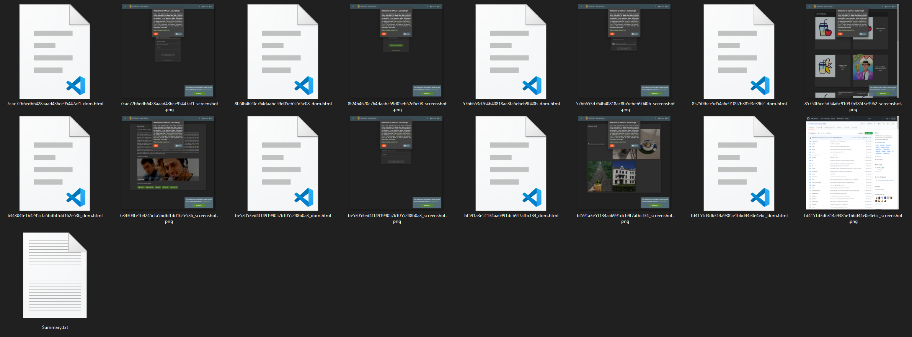
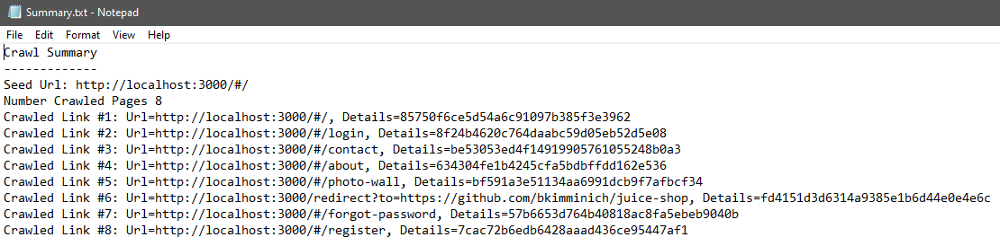

# appsec-spacrawler

# Overview
A simple web crawler, capable of crawling SPA sites using Puppeteer (Node.JS) and PuppeteerSharp (C#) - simply pass a url to start from, and watch it crawl.

# Getting started
You can either download the latest release, or build from source using Visual Studio 2019 installed with .NET Core 3.1.

The compiled exe can be run as follows: ```SpaCrawler.exe [options]```

# Configuration options
The following command line options may be passed:

* ```--seedUrl <url>```:                  [required] The url to start the crawl from.
* ```--depth <depth>```:                  [required] The maximum crawl depth relative to the seed url.
* ```--screenShots```:                    [optional] Take a screenshot at each page visted during the crawl.
* ```--dumpDom```:                        [optional] Dump the rendered DOM html to a file for each page visited during the crawl.
* ```--headless```:                       [optional] Use a headless browser for the crawl.
* ```--help```:                           [optional] Displays the help page.

# Results
Results are written to a directory called "results", one level up from the program entry point.

Following a successful crawl, the results folder will contain a Summary.txt file, which specifies a summary of the results including the number of crawled links and a list of each link crawled. 

Each crawled link has a unique id associated with it. The Summary.txt file helps to map a crawled link with its id.

For each crawled page, the results folder will also be populated with a png screenshot and a html file containing the rendered DOM html (if ```--screenShots``` and ```--dumpDom``` have been specfied as a command line switches respectivley). These files are identified by thei unique link id, which can be refernced in the Summary.txt file.

Examples:




# Acknowledgements
The project is written using Puppeteer and PuppeteerSharp and is based on the crawlsite example provided in the official Node.JS Puppeteer API Examples repository as developed by Google. The crawlsite.js and further examples of how to use Puppeteer can be found here: https://github.com/puppeteer/examples

PuppeteerSharp is a .NET port of the official Node.JS Puppeteer API written by [Darío Kondratiuk](https://github.com/kblok). The Github repository for PuppeteerSharp can be found here: https://github.com/hardkoded/puppeteer-sharp and the official website containing useful API documentation is here: https://www.puppeteersharp.com/ 

# Note
Please be careful when crawling websites using this tool. We have not yet implemented "do not crawl" restrictions. Always seek permission from the website owner before crawling any website.

The authors of appsec-spacrawler are not liable for any consequenes that occur due to users crawling sites they do not have permission for.
